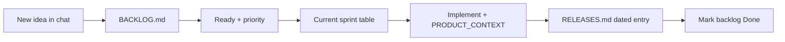

# Product operations guide — PLUTO

A lightweight playbook so you can act like a strong **product manager** on this repo without needing Jira on day one.

---

## What real teams maintain

| Artifact | What it answers | PLUTO file |
|----------|-----------------|------------|
| **Product backlog** | What *might* we build? In what rough priority? | [BACKLOG.md](BACKLOG.md) |
| **Sprint backlog** | What are we building *this* week/fortnight? | Top of [BACKLOG.md](BACKLOG.md) → “Current sprint” |
| **Release / changelog** | What *did* we ship or remove, and when? | [RELEASES.md](RELEASES.md) |
| **Product spec / context** | How does the product work *right now*? | [PRODUCT_CONTEXT.md](PRODUCT_CONTEXT.md) |
| **Engineering sprint notes** | How was it built? (security, refactors) | [docs/changelog/](../changelog/) |
| **Roadmap** | Themes for next quarter (Now / Next / Later) | Optional section in BACKLOG or separate doc later |

Yes — **maintaining a dated release file is normal.** Many teams use:

- **CHANGELOG.md** or **RELEASES.md** (user- and PM-facing)
- **Git tags** (`v2.1.0`) + GitHub Releases for customers
- **Internal sprint docs** (your `SPRINT_ABC_CHANGELOG.md` style)

Your idea of “features released by date” + “features removed by date” maps directly to **Added** and **Removed** sections in [RELEASES.md](RELEASES.md).

---

## Recommended workflow (solo or small team)

1. **Capture** — Any idea → [BACKLOG.md](BACKLOG.md). No coding until you explicitly prioritize.
2. **Refine** — Add priority, acceptance notes, link to job/candidate flow if relevant.
3. **Plan sprint** — Pick 3–7 items; copy IDs into “Current sprint” (1–2 weeks is fine for PLUTO).
4. **Ship** — Code + update [PRODUCT_CONTEXT.md](PRODUCT_CONTEXT.md) + add [RELEASES.md](RELEASES.md) section.
5. **Review** — Monthly: read RELEASES + backlog; close stale ideas as Won’t do.

---

## Sprints (simple version)

You do **not** need heavy Scrum tooling to start.

| Practice | Simple rule for PLUTO |
|----------|----------------------|
| **Sprint length** | 1 or 2 weeks |
| **Sprint goal** | One sentence, e.g. “Call analysis visible in MatchMaker results” |
| **Capacity** | Fewer items than you think; one integration (VoxPro) ≈ one sprint |
| **Ceremonies** | Optional: 15 min start (what’s in sprint), 15 min end (what shipped → RELEASES) |
| **Definition of Done** | Merged, documented in PRODUCT_CONTEXT, logged in RELEASES, tested on staging |

Engineering-heavy refactors can stay in `docs/changelog/`; **RELEASES** should stay readable for *you* as PM (outcomes, not file names).

---

## Working with the Cursor agent

| You say | Agent should |
|---------|----------------|
| “Add to backlog: …” | Append [BACKLOG.md](BACKLOG.md) only |
| “Implement CA-1” / “This sprint: …” | Code + docs + RELEASES when done |
| “What’s in the backlog?” | Summarize BACKLOG |
| “What shipped in May?” | Summarize [RELEASES.md](RELEASES.md) |
| “Log release for today” | New dated section in RELEASES |

---

## Backlog item quality (good vs weak)

**Good:** “Recruiter sees last VoxPro analysis on Job History row for that job ID, with link to full report.”

**Weak:** “Improve history.”

Include when possible: **who** (recruiter), **what** (outcome), **where** (page), **why** (pain).

---

## When to use PRODUCT_CONTEXT vs RELEASES

| Question | Read |
|----------|------|
| What routes exist today? | PRODUCT_CONTEXT |
| Did we remove inline VoxPro from MatchMaker? | RELEASES (2026-05-20) |
| Should we build PDF export for eval? | BACKLOG (RE-2) |
| How was CSRF added? | docs/changelog/SPRINT_ABC_CHANGELOG.md |

---

## Growing into “best PM” habits

1. **Say no with a line** — Won’t do + reason in backlog beats endless Idea rows.
2. **One source of truth per question** — Avoid duplicating specs in chat only; put it in BACKLOG or PRODUCT_CONTEXT.
3. **Ship notes = habit** — Every merge that users see → one RELEASES bullet; takes 2 minutes, saves hours later.
4. **Separate discovery from delivery** — Beta pages (Call Analysis) before merging into main flow = good pattern; keep CA-1 in backlog until sign-off.
5. **Metrics later** — Dashboard timings (RE-4) matter after core flows are stable.

---

## Optional next steps (when you want more structure)

- Git tags: `git tag v2.1.0` aligned with RELEASES headings
- Roadmap section in BACKLOG: **Now / Next / Later**
- Linear/Jira: import IDs from BACKLOG (CA-1, RE-2) as ticket keys
- User stories: “As a recruiter, I want … so that …” under each backlog row
